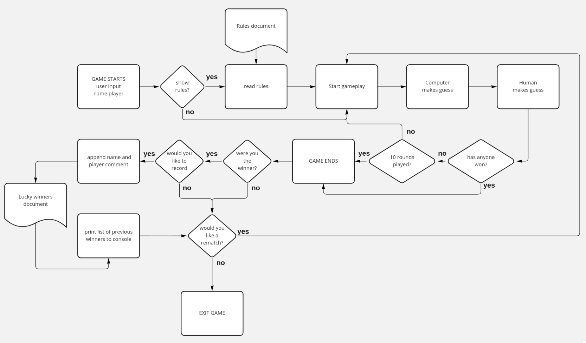
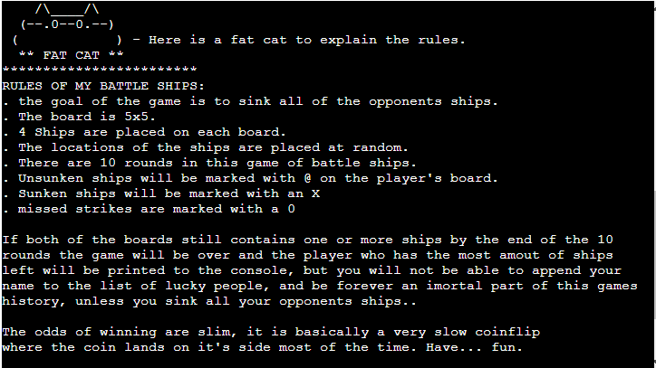
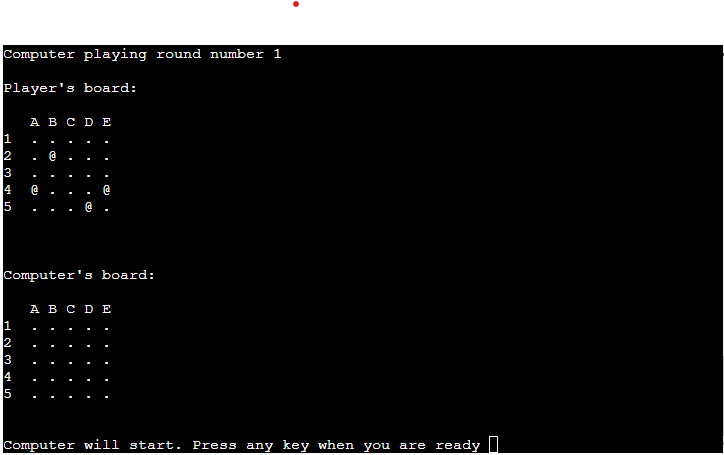
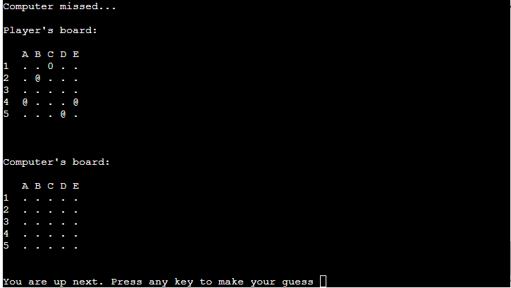
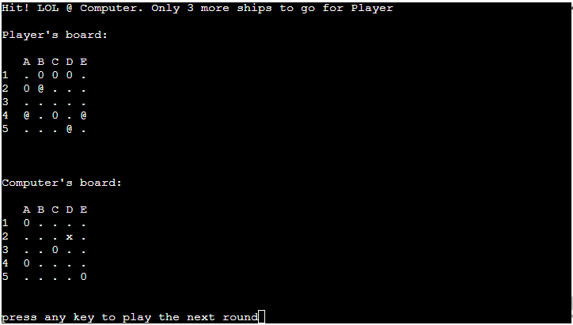
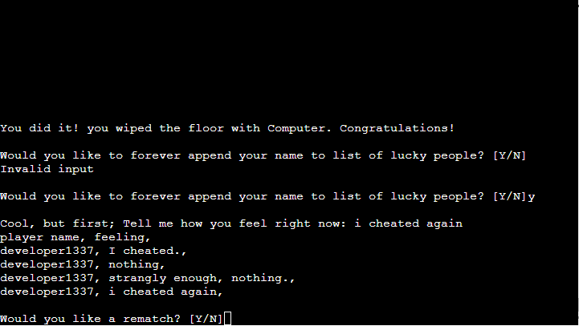
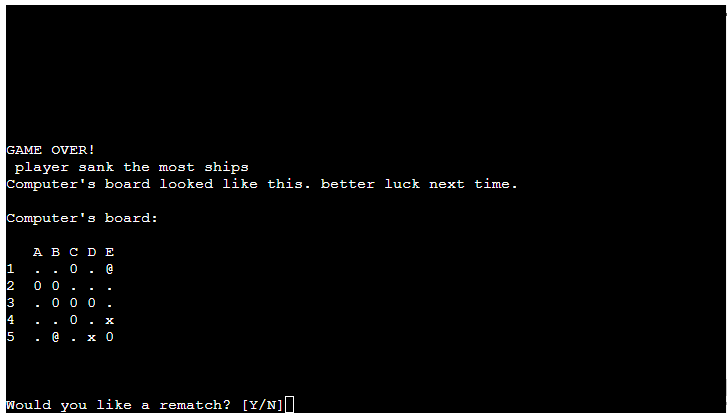
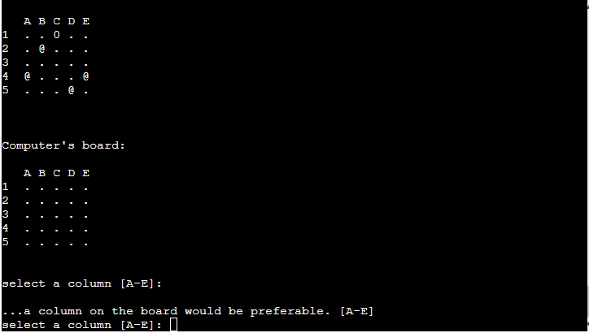

# Battle Ships


## Project outline
This is a game of Battle Ships that is written in Python and executed in the terminal.
<br>
<br>
Try it out here:
https://battle-ships-aa.herokuapp.com/
<br>
<br>

- **Game Features:**

  - User can choose name for himself and the opponent
  - user can read the rules before starting a new game
  - user can choose coordinates manually while computer makes random guesses.
  - error handling if user does something not allowed or that will break the game
  - cheat code that reveals position of the opponents ships
  - if the user wins, user can choose to append her name to a list of winners
  - make notes prioritized and have them showed up first in the list of notes


## Approach
  
  > This game is built fom the functionality and control flow outlined in this flow chart.
  >
  > You can for example see that if the user wants to see the rules before playing, an external txt-file is printed out to the terminal.

<br>
<br>

**In this game, I have created 3 main classes:**

- a board
- a player
- an artificial player

The player has access to everything the board contains, I saw this as logical since a player of a physical game, has access to the board.
So a player in this game is a subclass of the board, which inherits the attributes and methods that the board has. 

An artificial player is exactly like a player, but has another method for guessing since he can not use a keyboard like a human player. The artificial player class is there for a subclass of a player that inherits all methods and attributes of a player but has another method of guessing.


**Aside from the classes, this game has 2 main functions:**

- play function
- hit finder

The play function handles the flow of the game play and also evaluate if the game should end becuse somebody won.
the hit finder is a global function that checks position on the opponents board and returns information to the play function which is then presented to the user during the game play.

Aside from these two main function there are several calls to methods and creations of classes, that are all wrapped inside a third main function called main(). 


these five items is really all thats needed for the game to work, but I have also added some smaller functions to bring more functionality to the game. 

- if a player wins, he/she can choose to append its username to a list of previous winners. 
- if a player wants to read the rules, there is a function that prints out a text file containing the rules.

<br>
<br>


Here follows some information on the three classes that makes up the majority of this game.

### **The BoardMaker class**

> This is the class that creates a board for the Player class.
> it stores information such as board size, ship location and previous guesses. it has a method that prints the board in a human friendly way to the console.  It also has a method to reveal the ships, this is standard for a normal player, and with a cheat code you can also reveal the position of the opponents ships by calling the reveal ships method on the opponent if a the cheat code is entered. 


``` python
const handleSubmit = (event) => {
 class BoardMaker:
    def __init__(self, name, type):
        """
        Initializing a playing board
        """
        self.name = name
        self.board = [["."] * 5 for times in range(5)]
        self.type = type
        self.ship_locations = []
        self.guesses = []

    def place_ships(self):
        """
        method that creates a coordinate in tuple format and
        append it until the self.ship_locations list contains
        5 unique coordinates
        """
        while len(self.ship_locations) < 4:
            random_coordinate = (randint(0, 4), randint(0, 4))
            if random_coordinate not in self.ship_locations:
                self.ship_locations.append(random_coordinate)

    def print_board(self):
        """
        Method that prints the board to the console.
        """
        print(f"\n{self.name}'s board: \n")
        print("   A B C D E")
        row_count = 1
        for row in self.board:
            print(
                f"{row_count}  " + " ".join(row),
            )
            row_count += 1
        print("\n")

    def reveal_ships(self):
        """
        method that update ship_location list so that
        remaining ships can be printed
        """
        for ship in self.ship_locations:
            self.board[ship[0]][ship[1]] = "@"

```
<br>
<br>

### **The Player class**

> The player class inherits all the methods from the board, and adds a couple of new methods for itself.
> A player can update his board with correct or incorrect guesses from his opponent, he can make guesses based on input from a keyboard, and he can answer yes or no question prompted by the game, and return true or false, so that the game understands what the player wants. 

``` python
class Player(BoardMaker):
    """
    Subclass of the BoardMaker that represents a human player.
    Player has access to the board made in BoardMaker, a guess method and
    that collects user input and stores old guesses.
    """

    def __init__(self, name, type):
        super().__init__(name, type)

    def guess(self):
        """
        Method that collects a human guess, appends it to
        self.guesses and returns the current guess as a tuple.
        """
        letters = "abcde"
        numbers = "12345"
        false_input = "''"

        col = input("select a column [A-E]: ").lower()
        while col not in letters or col in false_input:
            print("\n...a column on the board would be preferable. [A-E]")
            col = input("select a column [A-E]: ").lower()

        row = input("select a row [1-5]: ")
        while row not in numbers or row in false_input:
            print("\n the ships are hiding within row 1-5... try again.")
            row = input("select a row [1-5]: ")

        guess = (int(row) - 1, letters.index(col))
        return guess

    def update_guesses(self, guess):
        """
        append guess to previus guesses memory
        """
        self.guesses.append(guess)

    def miss(self, guess):
        """
        visually update a miss to the board
        """
        self.board[guess[0]][guess[1]] = "0"

    def hit(self, guess):
        """
        visually update a hit to the board
        """
        self.board[guess[0]][guess[1]] = "x"

    def answer(self, question):
        """
        answer is a Player method that
        returns yes or no to a question asked to it.
        """
        if self.type == "human":
            check = input(f"{question} [Y/N]").lower()
            try:
                if check == "y":
                    return True
                elif check == "n":
                    return False
                else:
                    print("Answer 'Y' for Yes and 'N' for no")
                    return self.answer(question)
            except Exception:
                print("Invalid response")
        else:
            print(
                "I am not real, you cant ask me questions, I don't care..."
                )
```
<br>
<br>


### **The ArtificialPlayer class**

> The ArtificialPlayer class origins from a player, and has all those methods, but he can't guess based on keyboard input so instead his guess method is random.

``` python
class ArtificialPlayer(Player):
    """
    Subclass of the Player that represents a artificial player.
    ArtificialPlayer is a player that but with a random guess function.
    """

    def __init__(self, name, type):
        super().__init__(name, type)

    def guess(self):
        guess = (randint(0, 4), randint(0, 4))
        return guess
```
<br>
<br>

## Testing

Here follows some pictures how the game looks and handles. 


### **View the rules:**

>
>
> > Rules.txt is printed to the terminal if the player wants to see it.
> >
<br>  

### **Playing boards:**

>
>
> > This is what the board looks like.
> >  On top is the players board, and at the bottom is the hidden guess board, where the opponent has his hidden ships.
<br>

### **Computer miss:**

>
>
> > Computer missed a shot.
> >  A "0" is 
>appended to computers guessed coordinate C:1
<br>

### **Player hit:**

>
>
> > A player hit an opponent ship.
> >  An "X" is marking the sunken ship and a hit message is printed to the console. telling the player how many ships remains. 
<br>

### **Hitting last ship**

>
>
> > The last opponent ship was hit, this is the message you get.
> >  
<br>

### **append name**

>
>
> > Only if you win the game you get the chance to append your username to the list of lucky people.
> >  
<br>

### **No winner**

>
>
> > All 10 rounds went by, and no clear winner.. 
> > The game will tell you who sank the most ships and reveal opponents ship locations before printing the board.
> > In this case E:1 and B:5 held the ships.
<br>

### **Input handling**

>
>
> > Invalid input is handled through out the game.
> >
<br>

### **Validator Tests**

Apart from hours of playing battle ship, and from testing the code I have used the python validator PEP8. 


- Python:
  - Code Alright (run.py) [PEP8](http://pep8online.com/checkresult)

### Unfixed Bugs

**There is a bug within Code Institute's nodeJS mock terminal**
> When I wrote this code I imported "OS" and was running the os.system("clear") command in order to clear the terminal in between game rounds. 
>
> But after uploading my code to heroku and using the nodeJS "mock terminal" I saw that the terminal only clears 15 lines due to some sort of limitation in the mock terminal. I even trued to implement two os.system("clear") statements after each other but with no different result.
>
>> My work-around solution for this bug is to create 24 new lines between each round (print("\n") -*24), since the terminal has an viewer output of 24 rows x 80 columns.

---

## Deployment

This project was deployed using Code Institute's mock terminal using the following steps:
 
  - Fork / clone this repository
  - Create new heroku app
  - set the Build Packs to Python and NoteJS
  - Link heroku app to github repository
  - Deploy

> You can visit my live app by following this link:
>
> https://battle-ships-aa.herokuapp.com/

## Credit

> #### **Codecademy**
> I have studied python 3 at CodeCademy as an addition to the information on the topic provided by Code Institute.

---

### Some final words from the developer

Thank you for taking the time to read through this website documentation.

This project is the third of five milestone projects in a full stack developer course that I have enrolled through [Code Institute](https://codeinstitute.net).

I am not a big fan of the battle ship game but I am glad I chose it for my milestone project. There is so much events to handle even in a very small game like this and it was a great learning experience trying to figure out a personal way to tackle the challenges in building a terminal battle ships game.

-


> Notes - a study in JavaScript
>
> By Anton Askling 2022